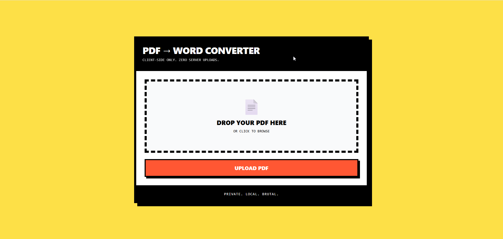
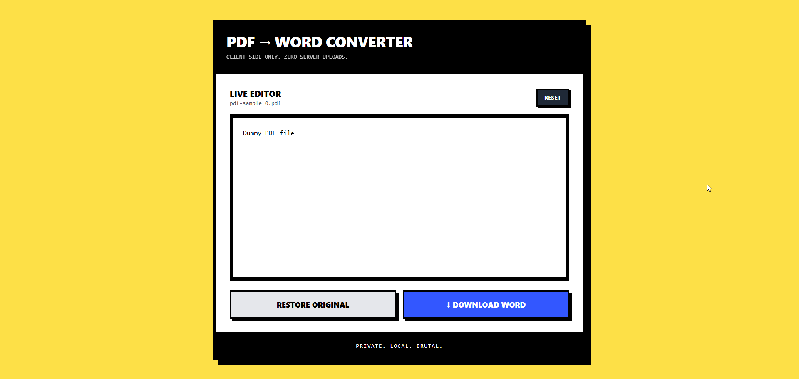

# PDF → Word Converter

A privacy-first, client-side PDF to Word document converter with live text editing capabilities. All processing happens in your browser—no server uploads, no data collection.


## 🎯 Features

- ** 100% Private**: All conversion happens in your browser. Files never leave your device.
- ** Live Editing**: Edit extracted text directly in the browser before downloading.
- ** Fast**: No server roundtrips. Instant PDF text extraction.
- ** Neo-Brutalist Design**: Bold, high-contrast interface with striking visual elements.
- ** Responsive**: Works on desktop and mobile browsers.
- ** Free Forever**: No accounts, no subscriptions, no hidden costs.

## 🚀 Live Demo

Try it now: [PDF to Word Converter](#) *(replace with your deployed URL)*

## 📸 Screenshots

<div align="center">
  
  
</div>

## 🛠️ Tech Stack

| Technology | Purpose |
|------------|---------|
| **React 18** | UI framework |
| **PDF.js** | PDF text extraction |
| **docx** | Word document generation |
| **Tailwind CSS** | Styling & Neo-Brutalist design |
| **Vite** | Build tool & dev server |

## 📋 Prerequisites

- Node.js >= 16.x
- npm or yarn

## 🔧 Installation

### 1. Clone the repository
```bash
git clone https://github.com/yourusername/pdf-to-word-converter.git
cd pdf-to-word-converter
```

### 2. Install dependencies
```bash
npm install
```

### 3. Start development server
```bash
npm run dev
```

The app will open at `http://localhost:3000`

## 📦 Build for Production

```bash
npm run build
```

Output will be in the `dist/` folder, ready for deployment.

## 🚢 Deployment

### Deploy to Vercel
```bash
npm install -g vercel
vercel
```

### Deploy to Netlify
```bash
npm install -g netlify-cli
netlify deploy --prod
```

### Deploy to GitHub Pages
```bash
npm run build
npm run deploy
```

## 📖 Usage

1. **Drop or select a PDF file** in the upload zone
2. **Wait for extraction** (usually < 2 seconds)
3. **Edit the text** directly in the live editor
4. **Click "Download Word"** to get your .docx file

### Supported PDF Types

✅ **Works well with:**
- Text-based PDFs
- Simple documents
- Reports and articles
- Plain-text resumes

⚠️ **Limited support for:**
- Complex tables (extracted as text)
- Multi-column layouts
- Embedded images (not extracted)
- Scanned PDFs (OCR not included)

## ⚙️ Configuration

### Change Port (optional)
Edit `vite.config.js`:
```javascript
export default defineConfig({
  server: {
    port: 3001, // Change to your preferred port
  }
});
```

### Customize Colors
Edit `src/App.jsx` and modify the color classes:
```jsx
// Orange button: bg-[#FF5733]
// Blue button: bg-[#3357FF]
// Yellow background: bg-yellow-300
```

## 🏗️ Project Structure

```
pdf-to-word-converter/
├── public/
│   └── index.html          # HTML template
├── src/
│   ├── App.jsx             # Main application component
│   ├── index.jsx           # React entry point
│   └── index.css           # Global styles (Tailwind)
├── package.json            # Dependencies
├── vite.config.js          # Vite configuration
├── tailwind.config.js      # Tailwind configuration
└── README.md
```

## 🤝 Contributing

Contributions are welcome! Please follow these steps:

1. Fork the repository
2. Create a feature branch (`git checkout -b feature/amazing-feature`)
3. Commit your changes (`git commit -m 'Add amazing feature'`)
4. Push to the branch (`git push origin feature/amazing-feature`)
5. Open a Pull Request

## 🐛 Known Limitations

- **Table Formatting**: Tables are extracted as plain text, not preserved as structured tables
- **Images**: Images and diagrams are not extracted (PDF.js limitation)
- **Scanned PDFs**: Requires OCR, not included in this version
- **Complex Layouts**: Multi-column documents may have text order issues

### Why These Limitations?

This tool uses client-side JavaScript libraries which have inherent constraints. For professional-grade conversion with perfect formatting, consider server-side solutions like Adobe PDF Services or LibreOffice.

## 🔐 Privacy & Security

- **No data transmission**: All processing happens locally in your browser
- **No tracking**: No analytics, cookies, or telemetry
- **No storage**: Files are processed in memory and discarded immediately
- **Open source**: Audit the code yourself

## 📄 License

This project is licensed under the MIT License - see the [LICENSE](LICENSE) file for details.

## 🙏 Acknowledgments

- [PDF.js](https://mozilla.github.io/pdf.js/) by Mozilla
- [docx](https://github.com/dolanmiu/docx) by dolanmiu
- [Tailwind CSS](https://tailwindcss.com/)
- Neo-Brutalist design inspiration

## 📧 Contact

**Your Name** - [@yourtwitter](https://twitter.com/yourtwitter) - your.email@example.com

Project Link: [https://github.com/yourusername/pdf-to-word-converter](https://github.com/yourusername/pdf-to-word-converter)

---

<div align="center">
  <strong>PRIVATE. LOCAL. BRUTAL.</strong><br>
  Made with 💪 by <a href="https://github.com/yourusername">Your Name</a>
</div>
